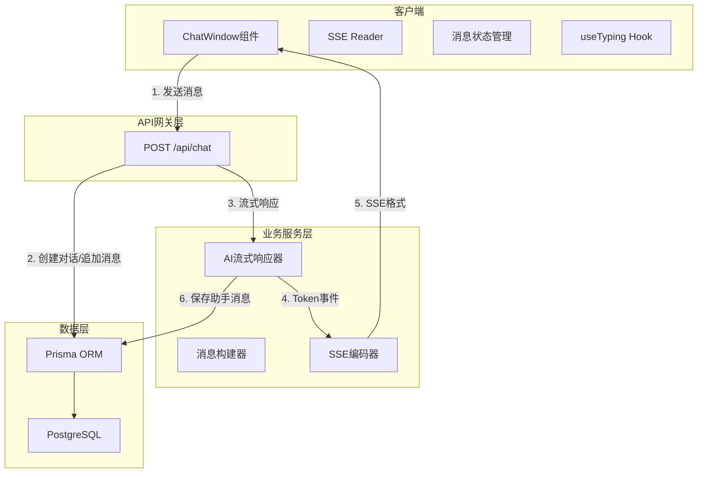
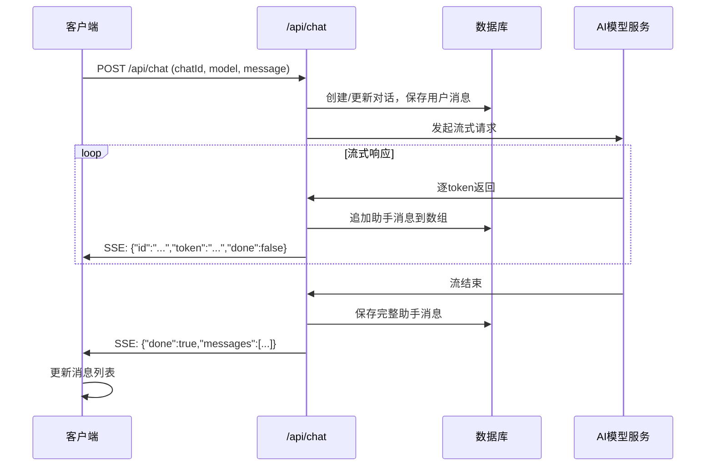
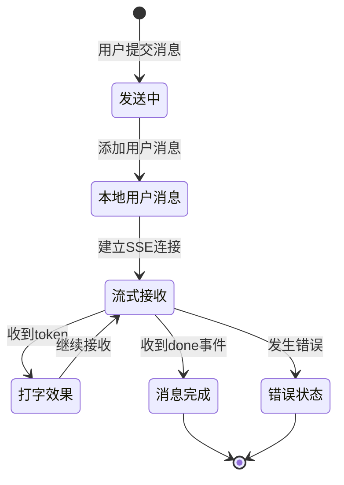

# AI对话模块技术设计文档

## 1. 架构概述

### 1.1 目标

- 确保AI助手回复正确持久化到数据库
- 修复SSE消息传输中的特殊字符转义问题
- 实现客户端与服务器消息状态同步，消除闪烁
- 为消息列表提供稳定的唯一标识符

### 1.2 架构原则

- 乐观更新与服务器确认相结合
- 消息ID由服务器统一生成
- SSE消息体必须安全转义

## 2. 系统架构

### 2.1 整体架构图



### 2.2 数据流设计



## 3. 服务设计

### 3.1 API设计

#### 3.1.1 POST /api/chat

**描述**: 处理用户消息，触发AI流式响应

**请求格式**:
```json
{
  "chatId": "string (optional)",
  "model": "string",
  "message": "string"
}
```

**响应格式** (SSE):
```json
{"type":"message","id":"...","data":{"role":"assistant","content":"..."}}
{"type":"token","token":"..."}
{"type":"done","messageId":"..."}
```

#### 3.1.2 错误响应

```json
{"type":"error","message":"..."}
```

### 3.2 SSE消息格式

| 事件类型 | 用途 | 数据结构 |
|---------|------|----------|
| message | 单条消息元数据 | {id, role, content} |
| token | 流式token | {token} |
| done | 流结束信号 | {messageId, finalMessages} |
| error | 错误信息 | {message} |

### 3.3 消息状态流转



## 4. 数据架构

### 4.1 消息结构

```typescript
interface Message {
  id: string           // 服务器生成的唯一ID
  role: 'user' | 'assistant' | 'system'
  content: string
  createdAt: string
}

interface Chat {
  id: string
  title: string
  model: string
  messages: Message[]
  createdAt: string
  updatedAt: string
}
```

### 4.2 消息保存策略

1. 用户消息: 发送前保存到数据库
2. 助手消息: 流结束后保存完整消息
3. 增量更新: 流式接收时在内存中累积

## 5. 组件设计

### 5.1 组件职责划分

| 组件 | 职责 |
|-----|------|
| ChatWindow | 消息列表展示、表单提交、SSE连接管理 |
| MessageBubble | 单条消息渲染 |
| useTyping | 流式打字效果状态管理 |

### 5.2 状态管理方案

```typescript
interface ChatState {
  messages: Message[]
  isLoading: boolean
  input: string
  currentChatId: string | null
  currentModel: string
}
```

### 5.3 Key稳定性策略

- 消息ID作为组件key
- ID由服务器端生成，确保全局唯一和不可变
- 避免使用内容相关的临时ID

## 6. 关键技术决策

### 6.1 Token转义方案

**方案**: 使用JSON.stringify对token进行转义

```typescript
// 转义函数
function escapeSSE(token: string): string {
  return JSON.stringify(token).slice(1, -1)
}

// 使用
const sseData = `data: {"token": "${escapeSSE(token)}"}\n\n`
```

**优点**: 简单可靠，覆盖所有需要转义的字符

### 6.2 消息保存时机

**方案**: 流结束后统一保存

- 流开始时不保存助手消息
- 流结束时构建完整消息数组，一次性保存
- 确保数据一致性

### 6.3 状态同步机制

**方案**: SSE事件携带消息ID

1. 客户端乐观添加用户消息（临时ID）
2. 服务器创建消息返回正式ID
3. 客户端用正式ID替换临时ID

## 7. 文件修改清单

| 文件 | 修改内容 |
|-----|----------|
| src/app/api/chat/route.ts | FR-001, FR-002 |
| src/modules/chat/ChatWindow.tsx | FR-003, FR-004 |
| src/modules/chat/MessageBubble.tsx | 接收消息ID |
| src/modules/chat/types.ts | 更新Message类型 |
| src/lib/constants.ts | 新增SSE配置常量 |

## 8. 风险与约束

### 8.1 风险点

- AI API响应超时可能导致消息不完整
- 网络中断需要重试机制

### 8.2 约束

- 不修改数据库表结构
- 保持向后兼容
- 不增加新的外部依赖